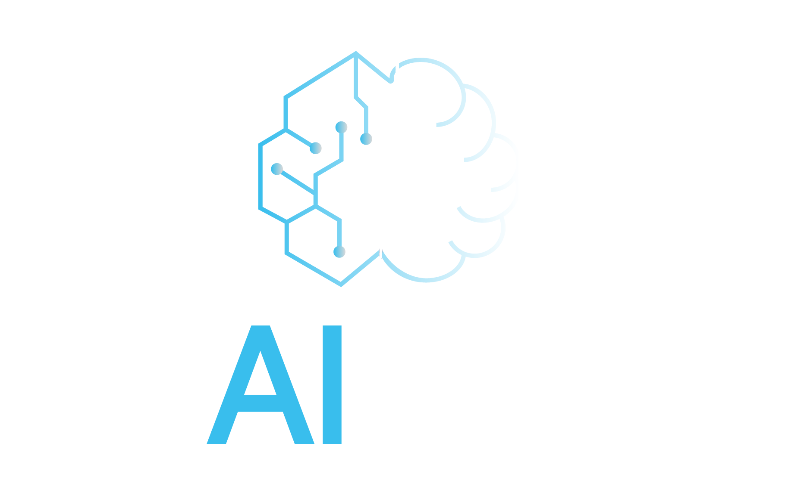
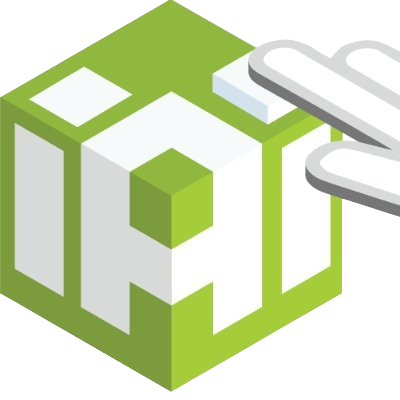
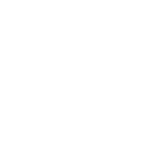
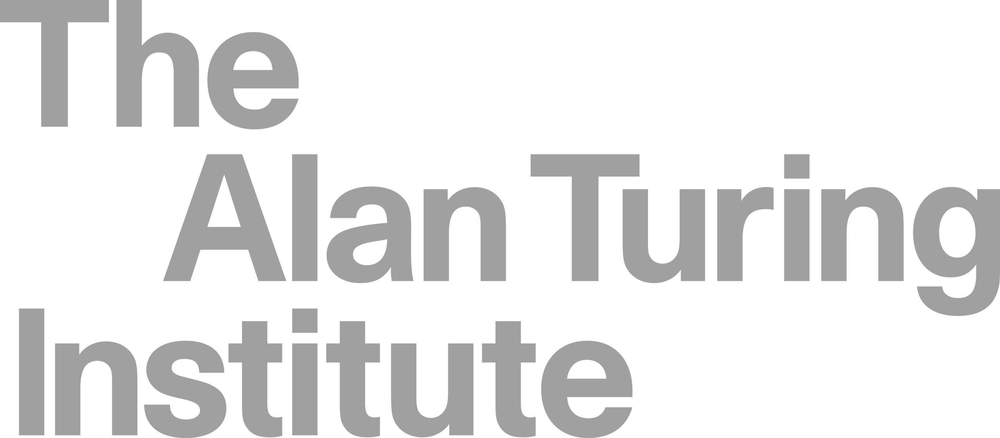
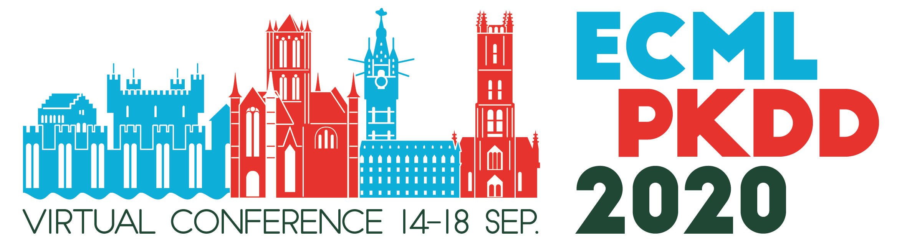

# Events

## AI and Humanity Summer Cluster 2022
<table>
  <tbody>
    <tr>
      <td style="text-align: left" width="200px"></td>
      <td style="text-align: left"><a href="2022_simons-institute"><b>Where Does the Understanding Come From When Explaining Automated Decision-making Systems?</b></a></td>
    </tr>
  </tbody>
</table>

## RMIT Lectorial 2022
<table>
  <tbody>
    <tr>
      <td style="text-align: left" width="200px"></td>
      <td style="text-align: left"><a href="2022_rmit-lectorial"><b>Transparency and Explainability</b></a></td>
    </tr>
  </tbody>
</table>

## TAILOR Summer School 2021
<table>
  <tbody>
    <tr>
      <td style="text-align: left" width="200px"></td>
      <td style="text-align: left"><a href="2021_tailor-summer-school"><b>What and How of Machine Learning Transparency:</b> <i>Building Bespoke Explainability Tools with Interoperable Algorithmic Components</i></a></td>
    </tr>
  </tbody>
</table>

## BIAS Summer School 2021
<table>
  <tbody>
    <tr>
      <td style="text-align: left" width="200px"></td>
      <td style="text-align: left"><a href="2021_bias"><b>Practical Machine Learning Explainability:</b> <i>Surrogate Explainers and Fairwashing</i></a></td>
    </tr>
  </tbody>
</table>

## TAILOR Workpackage 3 (2021)
<table>
  <tbody>
    <tr>
      <td style="text-align: left" width="200px"></td>
      <td style="text-align: left"><a href="2021_tailor-wp3"><b>Do You Trust Your Explainer?</b></a></td>
    </tr>
  </tbody>
</table>

## ADM+S 2021
<table>
  <tbody>
    <tr>
      <td style="text-align: left" width="200px"></td>
      <td style="text-align: left"><a href="2021_adms"><b>Making Machine Learning Explanations Truthful and Intelligible</b></a></td>
    </tr>
  </tbody>
</table>

## EURO 2021
<table>
  <tbody>
    <tr>
      <td style="text-align: left" width="200px"></td>
      <td style="text-align: left"><a href="2021_euro-explainability"><b>Making Machine Learning Explanations Truthful and Intelligible</b></a></td>
    </tr>
  </tbody>
</table>

## Turing AI UK 2021
<table>
  <tbody>
    <tr>
      <td style="text-align: left" width="200px"></td>
      <td style="text-align: left"><a href="2021_turing-ai-uk"><b>Did You Get That?</b> <i>Reviewing Intelligibility of State-of-the-art Machine Learning Explanations</i></a></td>
    </tr>
  </tbody>
</table>

## ECML-PKDD 2020
<table>
  <tbody>
    <tr>
      <td style="text-align: left" width="200px"></td>
      <td style="text-align: left"><a href="2020_ecml-pkdd"><b>What and How of Machine Learning Transparency:</b> <i>Building Bespoke Explainability Tools with Interoperable Algorithmic Components</i></a></td>
    </tr>
  </tbody>
</table>
