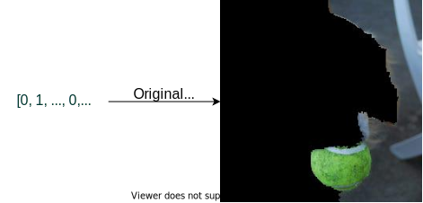

---
jupytext:
  formats: md:myst
  text_representation:
    extension: .md
    format_name: myst
    format_version: 0.13
    jupytext_version: 1.14.1
rise:
  start_slideshow_at: beginning
  theme: solarized
  transition: none
kernelspec:
  display_name: Python 3 (ipykernel)
  language: python
  name: python3
---

```{code-cell} ipython3
---
slideshow:
  slide_type: skip
tags: [hide-input]
---
import os
REPOSITORY = (
    'https://raw.githubusercontent.com/fat-forensics/resources/master/{}')
SCRIPTS = [
    'surrogates_overview/scripts/__init__.py',
    'surrogates_overview/scripts/image_classifier.py',
    'surrogates_overview/scripts/imagenet_label_map.py',
    'surrogates_overview/scripts/surrogates_overview.py'
]

! pip install -r requirements.txt

img = 'doggo.jpg'
img_path = 'surrogates_overview/img/{}'.format(img)
img_url = REPOSITORY.format(img_path)
if not os.path.exists(img):
    ! wget $img_url -O $img

scr = 'scripts/'
! mkdir -p $scr
for script in SCRIPTS:
    url = REPOSITORY.format(script)
    scrpt = scr + os.path.basename(script)
    if not os.path.exists(scrpt):
        ! wget $url -O $scrpt
```

```{code-cell} ipython3
---
slideshow:
  slide_type: skip
tags: [hide-input]
---
import matplotlib.pyplot as plt
plt.style.use('seaborn')
%matplotlib inline
```

```{code-cell} ipython3
---
slideshow:
  slide_type: skip
tags: [hide-input]
---
from PIL import Image

import numpy as np

import scripts.image_classifier as imgclf
import scripts.surrogates_overview as exo

import sklearn.datasets
import sklearn.linear_model
```

```{code-cell} ipython3
---
slideshow:
  slide_type: skip
tags: [hide-input]
---
# Load the image
doggo_img = Image.open('doggo.jpg')
doggo_array = np.array(doggo_img)

# Load the classifier
clf = imgclf.ImageClassifier()

# doggo_y = clf.predict(doggo)
doggo_proba = clf.predict_proba([doggo_array])
doggo_labels_3 = clf.proba2tuple(doggo_proba, labels_no=3)[0]

# Fix global options
SAMPLES = 10
BATCH = 100
```

+++ {"slideshow": {"slide_type": "skip"}, "tags": ["purge-cell"], "jupyter": {"source_hidden": true, "outputs_hidden": true}}

(sec:case-study:surrogates)=

+++ {"slideshow": {"slide_type": "slide"}}

<h1 style="text-align: center">Case Study: Surrogates</h1>
<h2 style="text-align: center">The Universal Explainers</h2>
<br><br><br><br><br><br>
<p style="vertical-align:bottom; float:right; font-size: 120%;"><b>Kacper Sokol</b></p>

+++ {"slideshow": {"slide_type": "slide"}}

## LIME: Local Interpretable Model-agnostic Explanations ##

+++ {"slideshow": {"slide_type": "subslide"}}


    
<span style="font-size: 18px;">(*Ribeiro et al., 2016. "Why should I trust you?" Explaining the predictions of any classifier*)</span>

+++ {"slideshow": {"slide_type": "subslide"}}

### Benefits ###

<div class="row">
<div class="column">

* **Model-agnostic** – work with any black box
* **Post-hoc** – can be retrofitted into pre-existing predictors
* **Data-universal** – work with image, tabular and text data because of interpretable data representations

</div>
<div class="column">
<br><br>

<!-- https://www.kindpng.com/imgv/hTbmhJ_silver-bullet-image-png-transparent-png/ -->


</div>
</div>

+++ {"slideshow": {"slide_type": "subslide"}}

### No Free Lunch ###

<div class="row">

<div class="column">

<br>


</div>

<div class="column fragment">
</br></br></br>

- Post-hoc explainers have poor fidelity
- A **generic** eXplainable Artificial Intelligence process is *beyond our reach* at the moment

</div>

</div>

+++ {"slideshow": {"slide_type": "subslide"}}

### bLIMEy, there has to be a better way... ###


bLIMEy &rarr; build LIME yourself\
(*Sokol et al., 2019. bLIMEy: Surrogate prediction explanations beyond LIME*)
* Framework for building surrogate explainers
* Meta-algorithm for operationalising them
* Accompanied by analysis of surrogate building blocks (akin to a user guide)
* Practical recommendations

**Good news:** A means to build flexible, faithful, interactive, ... surrogates\
**Not so good news:** It requires effort


+++ {"slideshow": {"slide_type": "skip"}}

### bLIMEy Framework


+++ {"slideshow": {"slide_type": "subslide"}}

### Operationalising surrogates ###

</br>
<div class="row">
<div style="flex: 75%;">

- To **use** surrogates, we need to understand
  * their provenance
  * how to (correctly) interpret their explanations

- To **build** surrogates, we should
  * choose suitable building blocks
  * evaluate & validate these

</div>
<div style="flex: 25%;">


<!-- **LIME: Local Interpretable Model-agnostic Explanations** -->
    
<!-- <span style="font-size: 18px;">(*Ribeiro et al., 2016. "Why should I trust you?" Explaining the predictions of any classifier*)</span> -->

</div>
</div>

+++ {"slideshow": {"slide_type": "slide"}}

## Surrogate Image Explainers ##

+++ {"slideshow": {"slide_type": "subslide"}}

### Image surrogates (LIME) ###

<div class="row">
<div class="column">
<br>


</div>
<div class="column fragment">
<br>


</div>
</div>

+++ {"slideshow": {"slide_type": "-"}}


+++ {"slideshow": {"slide_type": "subslide"}}

### Segmentation-based interpretable representation ###

</br>

<br>


+++ {"slideshow": {"slide_type": "subslide"}}

### Black-box prediction ###

```{code-cell} ipython3
---
slideshow:
  slide_type: skip
tags: [hide-input]
---
classification = exo.plot_image_prediction(doggo_labels_3, doggo_array)
```

```{code-cell} ipython3
---
slideshow:
  slide_type: '-'
tags: [hide-input]
---
classification
```

+++ {"slideshow": {"slide_type": "subslide"}}

### Prediction explanation ###

```{code-cell} ipython3
---
slideshow:
  slide_type: skip
tags: [hide-input]
---
# LIME explanation for tennis ball/golden retriever/Labrador retriever <->
# image colouring <-> bar plot
explain_classes = [(i[0], i[2]) for i in doggo_labels_3]
blimey_image = exo.build_image_blimey(
    doggo_array,
    clf.predict_proba,
    explain_classes,
    explanation_size=5,
    segments_number=13,
    occlusion_colour='mean',
    samples_number=SAMPLES,
    batch_size=BATCH,
    random_seed=42)
```

```{code-cell} ipython3
---
slideshow:
  slide_type: '-'
tags: [hide-input]
---
exo.plot_image_explanation(blimey_image, explain_classes[0])
```

+++ {"slideshow": {"slide_type": "subslide"}}

### Prediction explanation ###

```{code-cell} ipython3
---
slideshow:
  slide_type: '-'
tags: [hide-input]
---
exo.plot_image_explanation(blimey_image, explain_classes[1])
```

```{code-cell} ipython3
---
slideshow:
  slide_type: skip
tags: [hide-input]
---
exo.plot_image_explanation(blimey_image, explain_classes[2])
```

+++ {"slideshow": {"slide_type": "subslide"}}

### Explainer demo ###

```{code-cell} ipython3
---
slideshow:
  slide_type: skip
tags: [hide-input]
---
# Configure widgets to select occlusion colour, segmentation granularity and
# explained class
colour_selection = {
    i: i for i in ['mean', 'black', 'white', 'randomise-patch', 'green']
}
granularity_selection = {'low': 13, 'medium': 30, 'high': 50}
class_selection = {label: class_id for label, class_id in explain_classes}
```

```{code-cell} ipython3
---
slideshow:
  slide_type: skip
tags: [hide-input]
---
# Generate explanations
blimey_image_collection = {}
for gran_name, gran_number in granularity_selection.items():
    blimey_image_collection[gran_name] = {}
    for col_name in colour_selection:
        blimey_image_collection[gran_name][col_name] = exo.build_image_blimey(
            doggo_array,
            clf.predict_proba,
            explain_classes,
            explanation_size=5,
            segments_number=gran_number,
            occlusion_colour=col_name,
            samples_number=SAMPLES,
            batch_size=BATCH,
            random_seed=42)
```

```{code-cell} ipython3
---
slideshow:
  slide_type: skip
tags: [hide-input]
---
# Plot bar-plot explanation, image explanation and randomly occluded example
surrogate_image_explainer = exo.generate_image_widget(
    blimey_image_collection,
    granularity_selection,
    colour_selection,
    class_selection)
```

```{code-cell} ipython3
---
slideshow:
  slide_type: '-'
tags: [hide-input]
---
surrogate_image_explainer
```

+++ {"slideshow": {"slide_type": "subslide"}}

### Segmentation granularity and occlusion colour – 5 segments ###


+++ {"slideshow": {"slide_type": "subslide"}}

### Segmentation granularity and occlusion colour – 40 segments ###


+++ {"slideshow": {"slide_type": "slide"}}

## Surrogate Explainers of Tabular Data ##

+++ {"slideshow": {"slide_type": "subslide"}}

### Classifying iris flowers ###


```{code-cell} ipython3
---
slideshow:
  slide_type: skip
tags: [hide-input]
---
# Load the iris data set
iris = sklearn.datasets.load_iris()
iris_X = iris.data  # [:, :2]  #  take the first two features only
iris_y = iris.target

iris_labels = iris.target_names
iris_feature_names = iris.feature_names

label2class = {lab: i for i, lab in enumerate(iris_labels)}
feature2name = {i: feat for i, feat in enumerate(iris_feature_names)}

# Fit the classifier
logreg = sklearn.linear_model.LogisticRegression(C=1e5)
logreg.fit(iris_X, iris_y)
```

```{code-cell} ipython3
---
slideshow:
  slide_type: skip
tags: [hide-input]
---
# Configure widgets to select explained instance, discretisation and
# explained class
_dtype = iris_X.dtype
explained_instances = {
    'setosa': np.array([5, 3.5, 1.5, 0.25]).astype(_dtype),
    'versicolor': np.array([5.5, 2.75, 4.5, 1.25]).astype(_dtype),
    'virginica': np.array([7, 3, 5.5, 2.25]).astype(_dtype)
}

petal_length_idx = iris_feature_names.index('petal length (cm)')
petal_length_bins = [1, 2, 3, 4, 5, 6, 7]
petal_width_idx = iris_feature_names.index('petal width (cm)')
petal_width_bins = [0, .5, 1, 1.5, 2, 2.5]
discretisation = {
    petal_length_idx: {
        'range': petal_length_bins,
        'default': [2, 3],
        'step': 1
    },
    petal_width_idx: {
        'range': petal_width_bins,
        'default': [.5, 1],
        'step': .5
    }
}

# Fix global options
SAMPLE_IRIS = False
IRIS_SAMPLES = 50000
```

```{code-cell} ipython3
---
slideshow:
  slide_type: skip
tags: [hide-input]
---
surrogate_tabular_explainer = exo.generate_tabular_widget(
    explained_instances,
    discretisation,
    label2class,
    feature2name,
    iris_X,
    iris_y,
    logreg.predict_proba,
    samples_number=IRIS_SAMPLES,
    sample=SAMPLE_IRIS,
    random_seed=42)
```

+++ {"slideshow": {"slide_type": "subslide"}}

### Tabular surrogates (LIME) ###

<div class="row">
<div class="column">
<br>


</div>
<div class="column fragment">
<br>


</div>
</div>

+++ {"slideshow": {"slide_type": "-"}}


+++ {"slideshow": {"slide_type": "subslide"}}

### Interpretable representation ###
<br>

<br>


+++ {"slideshow": {"slide_type": "subslide"}}

### Explainer demo ###

```{code-cell} ipython3
---
slideshow:
  slide_type: '-'
tags: [hide-input]
---
surrogate_tabular_explainer
```

+++ {"slideshow": {"slide_type": "subslide"}}

### But why? Meaning of the explanations ###
<br>


+++ {"slideshow": {"slide_type": "subslide"}}

### But why? Meaning of the explanations (ctd.) ###
<br>
<br>


+++ {"slideshow": {"slide_type": "slide"}}

## Take-home Messages

+++ {"slideshow": {"slide_type": "subslide"}}

> Explainability algorithms **are not** *monolithic* entities

+++ {"slideshow": {"slide_type": "subslide"}}

> Explainers need to be **configured** or **tailor-made** for the application at hand

+++ {"slideshow": {"slide_type": "subslide"}}

> These are **diagnostic tools** that only become **explainers** when their  
> *provenance*, *caveats*, *properties* and *outputs* are well-understood

+++ {"slideshow": {"slide_type": "subslide"}}

> Do we really need to use complex methods to solve the problem at hand?
>
> * AI
> * ML
> * DL
> * [*insert the name of a new technology*]

+++ {"slideshow": {"slide_type": "slide"}}

## Where to Go from Here ##

+++ {"slideshow": {"slide_type": "subslide"}}


<h3><tt>FAT Forensics</tt> &lt;<a href="https://fat-forensics.org/">https://fat-forensics.org/</a>&gt;</h3>
<br>

* A modular Python toolkit for algorithmic Fairness, Accountability and **Transparency**
* Aimed at both *end-users* and *domain experts*
* Built for *research* and *deployment*

<br>

<hr>

<br>

- *Sokol et al., 2020. FAT Forensics: A Python toolbox for implementing and deploying fairness, accountability and transparency algorithms in predictive systems*
- *Sokol et al., 2022. FAT Forensics: A Python toolbox for algorithmic fairness, accountability and transparency*

+++ {"slideshow": {"slide_type": "subslide"}}


<h3>ECML-PKDD 2020 hands-on explainability tutorial</h3>
<br><br>

Tutorial resources: https://events.fat-forensics.org/2020_ecml-pkdd

<br>

<hr>

<br>

- *Sokol et al., 2020. What and How of Machine Learning Transparency: Building Bespoke Explainability Tools with Interoperable Algorithmic Components*

+++ {"slideshow": {"slide_type": "subslide"}}


<h3>Extra resources</h3>
<br><br>

* 2021 TAILOR – Summer School session
* University of Bristol Centre for Doctoral Training in Interactive Artificial Intelligence – BIAS Summer School session
* 2021 The Alan Turing Institute's AI UK
* …

<br>

<hr>

<br>

- <https://events.fat-forensics.org/>
- <https://github.com/fat-forensics/resources>

+++ {"slideshow": {"slide_type": "subslide"}}


<h3>Self-paced online learning materials</h3>
<br>
<!-- <br> -->

* Interactive online training resources on *interpretability*, *explainability* and *transparency*
* To be published in *late 2022 / early 2023*

<h3>PhD / Master's Course materials</h3>
<br>
<!-- <br> -->

* Comprehensive overview of *interpretability*, *explainability* and *transparency*
* To be published *sometime in 2023*
* (Possibly transformed into a MOOC later in the year)

+++ {"slideshow": {"slide_type": "slide"}}

&nbsp;

+++ {"slideshow": {"slide_type": "slide"}}

## Helpers ##

+++ {"slideshow": {"slide_type": "subslide"}}

### Feature partition ###

<div class="row">
<div class="column">
<br><br>


</div>
<div class="column">
<br>


</div>
</div>

+++ {"slideshow": {"slide_type": "subslide"}}

### Feature partition (ctd.) ###

<div class="row">
<div class="column">
<br>


</div>
<div class="column">
<br>


</div>
<div class="column">
<br>


</div>
<div class="column">
<br>


</div>
</div>

+++ {"slideshow": {"slide_type": "subslide"}}

### Sampling ###
<div class="row">
<div class="column">
<br>


</div>
<div class="column">
<br>


</div>
<div class="column">
<br>


</div>
<div class="column">
<br>


</div>
</div>

+++ {"slideshow": {"slide_type": "slide"}}

&nbsp;
